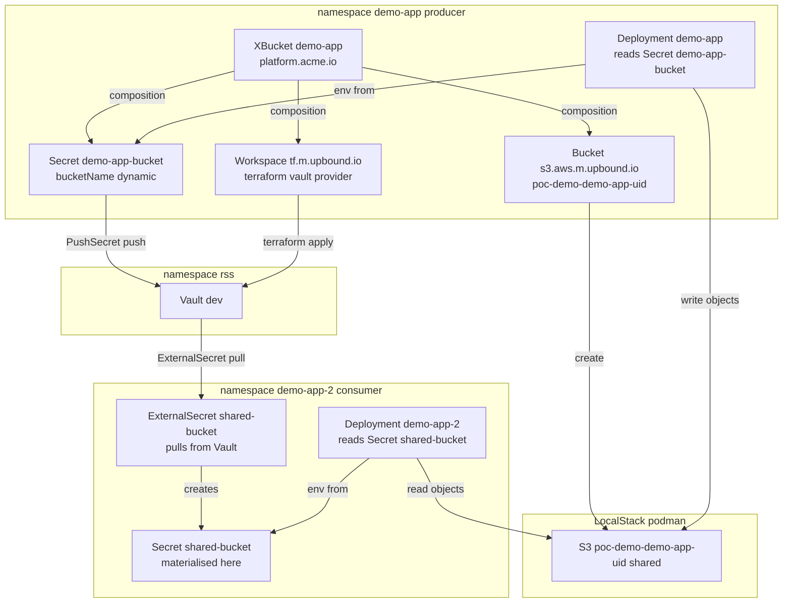

# Crossplane v2 PoC — S3 bucket via native v2 AWS provider, synced to Vault

A from-scratch, fully **v2-native** Crossplane proof of concept on a local
`kind` + `podman` cluster against LocalStack + Vault. A producer application
creates a **namespaced composite resource** (`XBucket`); Crossplane composes an
S3 bucket (via the **v2 native per-service AWS provider**), materialises the
dynamic bucket name into a Secret, and mirrors it into Vault through **two
independent paths** (External Secrets `PushSecret` and a Crossplane-native
terraform `Workspace`). A **second application in a separate namespace** then
reads that value *back out of Vault* via an ESO `ExternalSecret` and accesses
the same shared bucket — proving cross-namespace resource + secret sharing with
Vault as the substrate.

The whole stack comes up with one command: `./scripts/up.sh`.

---

## What "v2-native" means here

| Concern | v1 (legacy) | v2 (this PoC) |
|---|---|---|
| XR scope | cluster-scoped | **namespaced** (`scope: Namespaced`) |
| Front door | a **Claim** (`BucketClaim`) | the **XR created directly** by the app |
| XR API | `apiextensions.crossplane.io/v1` | `apiextensions.crossplane.io/v2` |
| Crossplane machinery on the XR | `spec.compositionRef` | `spec.crossplane.compositionRef` |
| S3 managed resource | `s3.aws.crossplane.io` (cluster) | `s3.aws.m.upbound.io` (**namespaced**) |
| Terraform managed resource | `tf.upbound.io` (cluster) | `tf.m.upbound.io` (**namespaced**) |
| AWS provider | monolithic `provider-aws:v0.49` (~800 MRs) | **per-service** `provider-aws-s3:v2.0.0` + auto-resolved `provider-family-aws` |
| Connection secret | `writeConnectionSecretToRef` | **composed native Secret** (connection secrets removed in v2) |

The `.m.` infix (`s3.aws.m.upbound.io`, `tf.m.upbound.io`) is the v2 convention
for namespaced managed resources. There are **no claims anywhere** in this PoC.

---

## Architecture

- **Three namespaces**: `demo-app` (producer), `demo-app-2` (consumer), `rss`
  (Vault).
- **Producer creates a namespaced `XBucket`** XR; Crossplane composes a real S3
  bucket in LocalStack (via the v2 native per-service AWS provider), a native
  Secret carrying the dynamic bucket name, and a terraform `Workspace`.
- **Dynamic value → Vault, two independent ways**: an ESO `PushSecret` (operator
  path) and the terraform `Workspace` (Crossplane-native path).
- **Consumer pulls it back** from Vault via an ESO `ExternalSecret` in a separate
  namespace, then reads the same shared bucket.
- **Vault is the sharing substrate** — there is no direct cross-namespace Secret
  access; the value round-trips through Vault.
- **LocalStack** runs outside the cluster on podman, reached via an in-cluster
  headless `Service` + manual `Endpoints`.
- **Fully v2-native**: namespaced XRs and MRs (`s3.aws.m.upbound.io`,
  `tf.m.upbound.io`), no claims, and composed resources inherit the XR's
  namespace automatically.



### Flow

1. `helm install demo-app` renders an **`XBucket`** (the v2 namespaced XR)
   directly in `demo-app`, plus a ConfigMap and Deployment.
2. Crossplane selects the composition and renders three composed resources, all
   landing in `demo-app` (the XR's namespace — automatic in v2):
   - **`Bucket`** (`s3.aws.m.upbound.io`) — the real S3 bucket in LocalStack.
   - **`Secret`** `demo-app-bucket` — the v2-native replacement for the
     deprecated connection secret, carrying the dynamic bucket name.
   - **`Workspace`** (`tf.m.upbound.io`) — runs `terraform apply` with the
     hashicorp/vault provider to write the bucket name into Vault.
3. The producer app consumes `demo-app-bucket` via `env.valueFrom.secretKeyRef`
   and writes objects to the bucket every 15 s.
4. The dynamic value reaches Vault two independent ways:
   - **ESO `PushSecret`** reads the composed Secret and writes
     `secret/crossplane/demo-app-bucket`.
   - The **terraform `Workspace`** writes
     `secret/crossplane-native/<bucket-name>`.
5. **Cross-namespace sharing (the new proof).** A second app in `demo-app-2`
   never touches the `demo-app` namespace. It uses an ESO **`ExternalSecret`**
   (the inverse of `PushSecret`: Vault → Kubernetes Secret) with its own
   namespace-local `SecretStore` to pull `secret/crossplane/demo-app-bucket` into
   a local Secret `shared-bucket`. The consumer pod (`secretKeyRef` on
   `shared-bucket`) cannot start until that Secret exists — so its readiness
   transitively proves the whole chain. It then reads the *same* LocalStack
   bucket and lists objects the producer is writing.

The deterministic bucket name is `<prefix><XR-name>-<XR-uid>`
(e.g. `poc-demo-demo-app-7a8aff31-cfcd-4e70-874a-aae7929d69b3`). The XR uid is
random and stable, so the name has a genuine random component while still being
knowable to the composition at render time (no fragile read-back of a
`generateName`'d resource).

Note on the two Vault paths from the consumer's perspective: the ESO path uses a
**stable key** (`crossplane/demo-app-bucket`) that a consumer can know in
advance — that is why the consumer reads it. The terraform-native path keys on
the **dynamic** bucket name, so it is a producer-side record rather than a
consumer-facing handle.

---

## Seams: the linkage snippets

The whole system is just five wiring points. These are the minimal snippets at
each seam, in data-flow order, so the architecture is legible without opening
the files.

**Seam 1 — one expression computes the name and threads it everywhere**
(`crossplane/composition.yaml`). The same `CombineFromComposite` value
(`<prefix><XR-name>-<XR-uid>`) is stamped into the Bucket's external name **and**
the Secret's `bucketName` **and** the terraform var (Seam 2):

```yaml
- type: CombineFromComposite
  combine:
    strategy: string
    variables:
      - fromFieldPath: spec.bucketPrefix
      - fromFieldPath: metadata.name      # XR name
      - fromFieldPath: metadata.uid       # random + stable
    string:
      fmt: "%s%s-%s"
  toFieldPath: metadata.annotations[crossplane.io/external-name]
```

**Seam 2 — composed Secret → Vault, native Crossplane**
(`crossplane/composition.yaml`, the `vault-secret` Workspace). A
`provider-terraform` Workspace runs `terraform apply` with the hashicorp/vault
provider; `var.bucket_name` is patched from Seam 1. Crossplane reconciles this
itself — no external operator:

```hcl
resource "vault_kv_secret_v2" "bucket" {
  mount     = "secret"
  name      = "crossplane-native/${var.bucket_name}"   # keyed on the dynamic name
  data_json = jsonencode({ bucketName = var.bucket_name })
}
```

**Seam 3 — composed Secret → Vault, ESO operator** (`eso/pushsecret.yaml`).
The independent "suspenders" path: External Secrets reads the composed Secret
and pushes it to Vault under a **stable key** a consumer can know in advance:

```yaml
selector:
  secret:
    name: demo-app-bucket                     # the composed Secret
data:
  - match:
      secretKey: bucketName
      remoteRef:
        remoteKey: crossplane/demo-app-bucket # stable key
        property: bucketName
```

**Seam 4 — Vault → consumer Secret, ESO pull** (`charts/demo-app-2/templates/eso.yaml`).
The inverse of Seam 3, in a different namespace: an `ExternalSecret` reads the
stable key back out of Vault and materialises a local Secret. This closes the
loop cross-namespace — `demo-app-2` never touches `demo-app`:

```yaml
target:
  name: shared-bucket
  creationPolicy: Owner
data:
  - secretKey: bucketName
    remoteRef:
      key: crossplane/demo-app-bucket         # the stable key Seam 3 wrote
      property: bucketName
```

**Seam 5 — consumer consumes the local Secret → shared bucket**
(`charts/demo-app-2/templates/deployment.yaml`). The pod cannot start until the
`shared-bucket` Secret exists (Seam 4), so its readiness self-proves the chain:

```yaml
env:
  - name: BUCKET_NAME
    valueFrom:
      secretKeyRef:
        name: shared-bucket
        key: bucketName
```

**The throughline:** Seam 1 is the single thread — one `prefix+name+uid`
expression is stamped into the Bucket, the Secret, and the terraform var. Seams
2 and 3 are the deliberately redundant push into Vault (Crossplane-native vs
operator). Seam 4 is the pull that closes the loop in another namespace, and
Seam 5 is the app actually using it.

---

## Components

- **LocalStack 4.3** — runs on the podman `kind` bridge network at a pinned IP
  (`10.89.1.10`); an in-cluster headless `Service` + manual `Endpoints` gives
  pods a stable DNS name (`localstack.localstack-system.svc.cluster.local:4566`).
- **Crossplane** (helm, latest stable) + `function-patch-and-transform`
  (functions are the v2 way; native P&T was removed).
- **`provider-aws-s3:v2.0.0`** — per-service v2 provider; auto-resolves its
  `provider-family-aws` dependency. Registers namespaced `s3.aws.m.upbound.io`.
- **`provider-terraform:v1.1.1`** — namespaced `tf.m.upbound.io` Workspace, used
  for the Crossplane-native Vault write (substitutes for the archived
  `provider-vault`). State is persisted via a terraform `kubernetes` backend.
- **Vault** (hashicorp helm, dev mode, root token `root`) in namespace `rss`.
- **External Secrets** — `PushSecret` + `SecretStore` in `demo-app` (producer
  side, Kubernetes → Vault), and an `ExternalSecret` + its own `SecretStore` in
  `demo-app-2` (consumer side, Vault → Kubernetes).

---

## The hard-won v2 gotchas (read these)

These are the non-obvious things that block a v2 native AWS provider against
LocalStack. Each cost real debugging time.

### 1. Host inotify limit (crashloop: "too many open files")

`provider-aws-s3` registers ~48 S3 CRDs and watches them all, each costing an
inotify instance. The kernel default `fs.inotify.max_user_instances=128` is
shared across the whole kind node (control plane + every provider) and gets
exhausted, crashing the controller with `too many open files`. This is a
**host** sysctl — rootless podman/kind cannot change it from inside the node.

```
sudo sysctl -w fs.inotify.max_user_instances=8192 fs.inotify.max_user_watches=1048576
# persist:
printf 'fs.inotify.max_user_instances=8192\nfs.inotify.max_user_watches=1048576\n' \
  | sudo tee /etc/sysctl.d/99-inotify.conf
```

`up.sh` warns at step 0 if this is still low.

### 2. The per-service provider needs the family provider's RBAC

`provider-aws-s3` must read/manage the `provider-family-aws` CRDs
(`clusterproviderconfigs`, `providerconfigs`, `providerconfigusages`), but its
**auto-generated RBAC omits them** (they belong to the family package). Without
a manual grant the controller errors `failed waiting for *v1beta1.ClusterProviderConfig
Informer to sync` and `cannot apply ProviderConfigUsage ... forbidden`.

Fix: `crossplane/provider-aws-s3-rbac.yaml` — a `ClusterRole`
(`read-aws-family-config`) bound to the provider's ServiceAccount. The binding
targets the **stable** SA `provider-aws-s3` (see next).

### 3. Pin a stable ServiceAccount via DeploymentRuntimeConfig

Provider revisions create a hashed SA name (`provider-aws-s3-06a50063a67d`)
that changes on every revision, which would break the RBAC binding above.
`crossplane/provider-aws-s3-runtime.yaml` is a `DeploymentRuntimeConfig` that
pins `serviceAccountTemplate.metadata.name: provider-aws-s3` so the RBAC
binding survives upgrades.

### 4. `endpoint.source: Custom` + `endpoint.services: [s3]` — both required

The v2 AWS provider uses AWS SDK v2. In the `ClusterProviderConfig`:

- **`source: Custom`** is required for the static URL to be honoured. With the
  default (`ServiceMetadata`) the SDK resolves the endpoint from AWS service
  metadata — i.e. **real AWS** — silently ignoring your static URL.
- **`services: [s3]`** is required for the override to apply at all. Without
  it the override applies to **no** service and requests again go to real AWS,
  returning `403 InvalidAccessKeyId` (real-AWS-style `RequestID`/`HostID`, and
  nothing shows up in LocalStack logs).

The diagnostic tell: if LocalStack logs show **no** incoming request but the MR
reports a 403 with an AWS-style `HostID`, the traffic is going to real AWS, not
LocalStack — your endpoint override is not being applied.

### 5. Credentials: `source: Secret` with an INI body

`source: None` yields empty credentials ("static credentials are empty" — upjet
does **not** fall back to the SDK chain). There is no `Environment` source. Use
`source: Secret` with a shared-credentials INI body (`[default]` +
`aws_access_key_id = test` / `aws_secret_access_key = test`). The LocalStack
helpers `skip_credentials_validation`, `skip_region_validation`,
`skip_metadata_api_check`, `skip_requesting_account_id`, `s3_use_path_style`
are all set.

### 6. `spec.crossplane.compositionRef` (not `spec.compositionRef`)

In v2 the XR's Crossplane machinery moved under `spec.crossplane`. Putting
`compositionRef` directly under `spec` fails server-side apply with
`field not declared in schema`.

### 7. `providerConfigRef.kind` is required and defaults to `ClusterProviderConfig`

Both the S3 `Bucket` and the terraform `Workspace` set
`providerConfigRef: { kind: ClusterProviderConfig, name: ... }`. The
cluster-scoped `ClusterProviderConfig` is the v2 idiomatic target for shared
credentials — referenced by name from any namespace.

---

## Lessons learned: what cost rework

Honest retrospective. Each row is a mistake that caused an apply-fail-retry loop
or a debugging detour, and what would have avoided it.

| # | Mistake | What happened | Hindsight (faster path) |
|---|---------|---------------|-------------------------|
| 1 | Debugged auth before checking where the request landed | Spent ~5 cycles on credentials (`source: None` → `Environment`, which isn't even in the enum → `Secret`) chasing `InvalidAccessKeyId` | Traffic was going to **real AWS, not LocalStack**. Ask "is the request reaching LocalStack?" *first* — one `podman logs localstack` during a reconcile. Tell: real-AWS-style `RequestID`/`HostID` + zero LocalStack log lines. |
| 2 | Re-extracted a schema, then ignored it | Had already printed the `credentials.source` enum and the `endpoint.services` field, then wrote `source: Environment` and omitted `services` | Act on the schema you just dumped; don't re-guess from memory. |
| 3 | Didn't fix the known resource limit before installing | Gambled that a "lean" install would dodge the inotify exhaustion seen in the v1 spike; it didn't (`provider-aws-s3` alone needs ~48 instances). Also wasted a turn on `sysctl` inside the node (denied under rootless podman) | Raise host `fs.inotify.max_user_instances` as a **precondition**, before installing any upjet provider. |
| 4 | Iterated RBAC one permission at a time | Granted read on configs → then `create` on `providerconfigusages` → then re-bound after the SA changed | The upjet family gap is predictable: read-on-configs + CRUD-on-usages, bound to a stable SA. Write the complete `ClusterRole` first try. |
| 5 | Manually installed the family provider | Installed `provider-family-aws` on top of the revision `provider-aws-s3` auto-resolves, creating duplicates and polluting the cluster | Per-service providers auto-resolve their family dependency; don't install it manually. |
| 6 | Repeated v2 mistakes that were in my own notes | `spec.compositionRef` (should be `spec.crossplane.*`) and the HCL single-line one-arg-per-line rule | Apply the notes already written; slow down on the parts you "know". |
| 7 | Reactive, one-error-at-a-time debugging | Read error → fix one thing → re-apply → read next error | Reason about the full dependency chain (family RBAC + SDK-v2 endpoint semantics + v2 field moves) up front — ~3 iterations collapse into one. |

The throughline on #1, #2, #4, #7: I debugged reactively instead of verifying
the lowest layer first (is the request even arriving?) and reasoning about the
whole chain before changing anything.

---

## Repository layout

```
crossplane-poc-v2/
  kind/config.yaml                       kind cluster (podman)
  crossplane/
    function-patch-and-transform.yaml    the v2 composition function
    providers.yaml                       provider-aws-s3 (v2) + provider-terraform
    provider-aws-s3-runtime.yaml         DeploymentRuntimeConfig (stable SA)
    provider-aws-s3-rbac.yaml            family-config RBAC for the SA
    aws-creds-secret.yaml                LocalStack creds (INI)
    provider-config.yaml                 ClusterProviderConfig (AWS -> LocalStack)
    provider-config-terraform.yaml       ClusterProviderConfig (tf kubernetes backend)
    localstack-service.yaml              in-cluster Service + manual Endpoints
    xrd.yaml                             XBucket XRD (v2, Namespaced, no claims)
    composition.yaml                     Bucket + Secret + Vault Workspace
  charts/demo-app/                       producer: XBucket + ConfigMap + Deployment
  charts/demo-app-2/                     consumer: ExternalSecret + Deployment (reads from Vault)
  eso/pushsecret.yaml                    producer side: vault-token + SecretStore + PushSecret
  scripts/up.sh, down.sh                 bootstrap / teardown
```

---

## File reference

What each file does and the non-obvious bits inside it. (The tree above is the
map; this is the detail.)

### Bootstrap & cluster

| File | Role | What's inside that matters |
|------|------|----------------------------|
| `scripts/up.sh` | Idempotent 9-step bootstrap | Ordering is load-bearing: LocalStack → kind → helm charts → function → **runtime config before providers** → wait for the stable SA → **RBAC** → wait healthy → ProviderConfigs → XRD/Composition → demo app → ESO. Step 0 has an **inotify preflight** that warns if `fs.inotify.max_user_instances < 512`. |
| `scripts/down.sh` | Teardown | `kind delete cluster` + `podman rm -f localstack`; `--purge` also removes the `kindest/node` image. |
| `kind/config.yaml` | kind cluster (podman) | Single control-plane node; relies on `KIND_EXPERIMENTAL_PROVIDER=podman`. Never add `extraMounts: /var/run` (it collides with the `/var/run → /run` symlink). |

### Provider plumbing (the v2-native AWS stack)

| File | Role | What's inside that matters |
|------|------|----------------------------|
| `crossplane/providers.yaml` | Installs the v2 providers | `provider-aws-s3:v2.0.0` (auto-resolves its `provider-family-aws` dependency — do **not** install family manually) + `provider-terraform:v1.1.1`. aws-s3 carries `spec.runtimeConfigRef` → the stable-SA runtime config. |
| `crossplane/provider-aws-s3-runtime.yaml` | `DeploymentRuntimeConfig` | Pins a **stable ServiceAccount** `provider-aws-s3` via `serviceAccountTemplate`, so the family-config RBAC binding survives revisions. Must set `deploymentTemplate.spec.selector` + matching template labels (apply fails otherwise). |
| `crossplane/provider-aws-s3-rbac.yaml` | Family-config RBAC (the upjet gap fix) | `ClusterRole read-aws-family-config`: read on `clusterproviderconfigs`/`providerconfigs` + full CRUD on `providerconfigusages` (all `aws.m.upbound.io`), bound to the stable SA. |
| `crossplane/provider-config.yaml` | AWS `ClusterProviderConfig` (`localstack`) | The make-or-break bits: `endpoint.source: Custom` **and** `endpoint.services: [s3]` (both required or traffic goes to real AWS), static URL to the in-cluster Service, `credentials.source: Secret`, plus all LocalStack helpers (`skip_credentials_validation`, `skip_region_validation`, `skip_metadata_api_check`, `skip_requesting_account_id`, `s3_use_path_style`). See gotchas #4/#5. |
| `crossplane/aws-creds-secret.yaml` | LocalStack credentials | INI body (`[default]` + `aws_access_key_id = test` / `aws_secret_access_key = test`) consumed by `provider-config.yaml`. |
| `crossplane/provider-config-terraform.yaml` | tf `ClusterProviderConfig` (`terraform-default`) | terraform `kubernetes` backend storing tfstate in a Secret in `crossplane-system` — **required**: provider-terraform does not persist state, and without it the first observe fails "No state file was found". |
| `crossplane/localstack-service.yaml` | In-cluster route to LocalStack | Headless `Service` (no selector) + manual `Endpoints` at the pinned podman IP `10.89.1.10` → stable DNS `localstack.localstack-system.svc.cluster.local:4566`. |
| `crossplane/function-patch-and-transform.yaml` | Composition function | v2 renders compositions via **functions** (native P&T was removed). Pinned `v0.10.7`. |

### Crossplane definitions

| File | Role | What's inside that matters |
|------|------|----------------------------|
| `crossplane/xrd.yaml` | `XBucket` XRD | `apiVersion: apiextensions.crossplane.io/v2`, `scope: Namespaced`, and **no `claimNames`** (v2 drops claims). One input field, `spec.bucketPrefix` (default `poc-bucket-`). |
| `crossplane/composition.yaml` | The composition | Pipeline mode → `function-patch-and-transform`. Renders three composed resources that all land in the XR's namespace automatically: `Bucket` (`s3.aws.m.upbound.io`), a native `Secret` (the v2 replacement for connection secrets), and a `Workspace` (`tf.m.upbound.io`) for the native Vault write. Bucket name is deterministic — `CombineFromComposite` of `prefix + XR name + XR uid` — set as the `external-name` annotation. |

### Demo app (Helm chart) — producer

| File | Role | What's inside that matters |
|------|------|----------------------------|
| `charts/demo-app/templates/xr.yaml` | App creates the XR directly | `kind: XBucket` in the release namespace with `spec.crossplane.compositionRef` (the v2 path — not `spec.compositionRef`). **No claim.** |
| `charts/demo-app/templates/deployment.yaml` | The producer app | Reads `demo-app-bucket` via `secretKeyRef` → renders the ConfigMap → writes an object to LocalStack every `pollSeconds`. |
| `charts/demo-app/templates/configmap.yaml` | App config template | `${BUCKET_NAME}` substituted from the Secret at pod startup — this is how the app consumes what Crossplane created. |
| `charts/demo-app/values.yaml` | Config knobs | `name` (XR/Release name), `bucketPrefix` (`poc-demo-`), `namespace` (`demo-app`), `image`, `pollSeconds`. |
| `charts/demo-app/Chart.yaml` | Chart metadata | `v2` Helm chart; the XBucket + ConfigMap + Deployment it installs. |

### Consumer app (Helm chart) — `demo-app-2`, cross-namespace reader

| File | Role | What's inside that matters |
|------|------|----------------------------|
| `charts/demo-app-2/templates/eso.yaml` | Pull value from Vault | Three objects in `demo-app-2`: its own `vault-token` + namespace-scoped `SecretStore` (SecretStore cannot be shared across namespaces), and an **`ExternalSecret`** — the inverse of `PushSecret` — materialising `secret/crossplane/demo-app-bucket` into a local Secret `shared-bucket` (`refreshInterval: 10s`). |
| `charts/demo-app-2/templates/deployment.yaml` | The consumer app | `secretKeyRef` on `shared-bucket`. The pod will **not start until that Secret exists** — i.e. until the ExternalSecret has pulled the value from Vault — so pod readiness self-proves the whole chain. Lists objects the producer is writing to the shared LocalStack bucket. |
| `charts/demo-app-2/values.yaml` | Config knobs | `name`/`namespace` (`demo-app-2`), `vaultPath` (`crossplane/demo-app-bucket` — the stable key the producer's PushSecret writes), `image`, `pollSeconds`. |
| `charts/demo-app-2/Chart.yaml` | Chart metadata | Separate chart because the consumer does something different (reads from Vault; creates no XR). |

### External Secrets (producer side — Vault path A, push)

| File | Role | What's inside that matters |
|------|------|----------------------------|
| `eso/pushsecret.yaml` | ESO push to Vault (the "suspenders") | Three objects in `demo-app`: `vault-token` Secret (`root`), a `SecretStore` pointing cross-namespace at `vault.rss.svc:8200`, and a `PushSecret` mirroring `demo-app-bucket` → Vault KV at `secret/crossplane/demo-app-bucket`. `refreshInterval: 10s`. (The terraform `Workspace` in the composition is the independent "belt".) |

---

## Running

```
./scripts/up.sh        # LocalStack -> kind -> Crossplane -> providers ->
                       # ProviderConfigs -> XRD/Composition -> demo-app ->
                       # ESO push -> demo-app-2 consumer (pull from Vault)
./scripts/down.sh      # delete cluster + stop LocalStack
```

### Verified proof points

- `kubectl -n demo-app get xbucket` — producer XR `Ready=True`.
- `kubectl -n demo-app logs deploy/demo-app` — producer writing objects every ~15 s.
- `podman exec localstack awslocal s3api list-buckets` — the dynamic bucket exists.
- `kubectl -n rss exec vault-0 -- vault kv get secret/crossplane/demo-app-bucket`
  — **ESO** path in Vault.
- `kubectl -n rss exec vault-0 -- vault kv list secret/crossplane-native` —
  **Crossplane-native** (terraform) path.
- `kubectl -n demo-app-2 get externalsecret shared-bucket` — consumer
  `Synced=True` (it pulled the value from Vault).
- `kubectl -n demo-app-2 logs deploy/demo-app-2` — consumer shows the **same**
  dynamic bucket name (obtained via Vault, not from `demo-app`) and lists the
  producer's objects in the shared bucket. This is the cross-namespace sharing
  proof.

---

## Key trade-offs / notes

- **Per-service v2 provider** keeps the inotify footprint far smaller than the
  monolithic `provider-aws` (~48 vs ~800 CRDs) but still needs the host inotify
  bump + the family-config RBAC grant.
- **Deterministic naming** (`prefix+xrname+uid`) avoids the SSA/read-back
  fragility of `generateName` while keeping a real random component.
- **Two Vault paths** are deliberately redundant ("belt and suspenders"): ESO
  is the generic operator path; the terraform `Workspace` proves Crossplane
  itself can drive secrets into Vault without an external operator.
- Vault runs in **dev mode** with `root` token — a real deployment would use
  scoped auth. State is in-memory; restarting Vault loses data (intentional for
  a local PoC).

---

## PoC shortcuts vs production requirements

Every row below is something this PoC does that is acceptable for a local
demonstration but **must not** ship to production.

| Area | PoC shortcut (NOT for prod) | Production requirement |
|------|-----------------------------|------------------------|
| Vault | dev mode, literal `root` token, in-memory, HTTP | real auth (Kubernetes / PKI), persistent raft storage, TLS |
| Cloud credentials | `test`/`test` + `token: root` **hardcoded in manifests** (terraform module + `vault-token` Secret) | IRSA / WebIdentity / PodIdentity for AWS; Vault token from a real auth method; never committed to git |
| Secret material | plaintext composed Secret (`bucketName`) | encryption at rest + rotation; sensitive outputs via a real secret store |
| LocalStack plumbing | headless in-cluster `Service` + manual `Endpoints` at a pinned podman IP (`10.89.1.10`) | real AWS (drop the endpoint override entirely) or a proper `Service` with a selector |
| Provider-config flags | `skip_credentials_validation`, `skip_region_validation`, `skip_metadata_api_check`, `skip_requesting_account_id`, `s3_use_path_style` | remove all of them — real AWS validates each |
| Transport | plain HTTP internally (LocalStack, Vault) | HTTPS end-to-end |
| RBAC | broad cluster-scoped `read-aws-family-config` grant to a provider SA (forced by the upjet gap) | scope tightly, audit, and track the upstream issue; prefer namespaced grants |
| Network | no `NetworkPolicy` | deny-by-default `NetworkPolicy` between namespaces |
| Sizing / HA | no requests/limits, single replica, no PDB | sized resources, HA replicas, `PodDisruptionBudget`s, health checks |
| Terraform state | single shared k8s Secret (`tfstate-default`) | per-Workspace isolation, encryption at rest, remote backend (S3 + DynamoDB locking) |
| Observability | none | metrics / dashboards / alerting for Crossplane and every provider |
| Delivery | local `helm upgrade` | GitOps (ArggoCD / Flux), CI, drift detection, managed upgrade path |
| Node config | host `inotify` raised globally | size nodes so providers fit; treat it as node-level config, not a global sysctl crutch |
| Behavioural noise | 10 s PushSecret `refreshInterval` + 15 s app write loop | back off to sane intervals |

The marker for "PoC only": a hardcoded credential, a LocalStack-specific flag,
a manual `Endpoints`, a broad cluster RBAC grant, or a single-replica /
no-state-isolation assumption.
